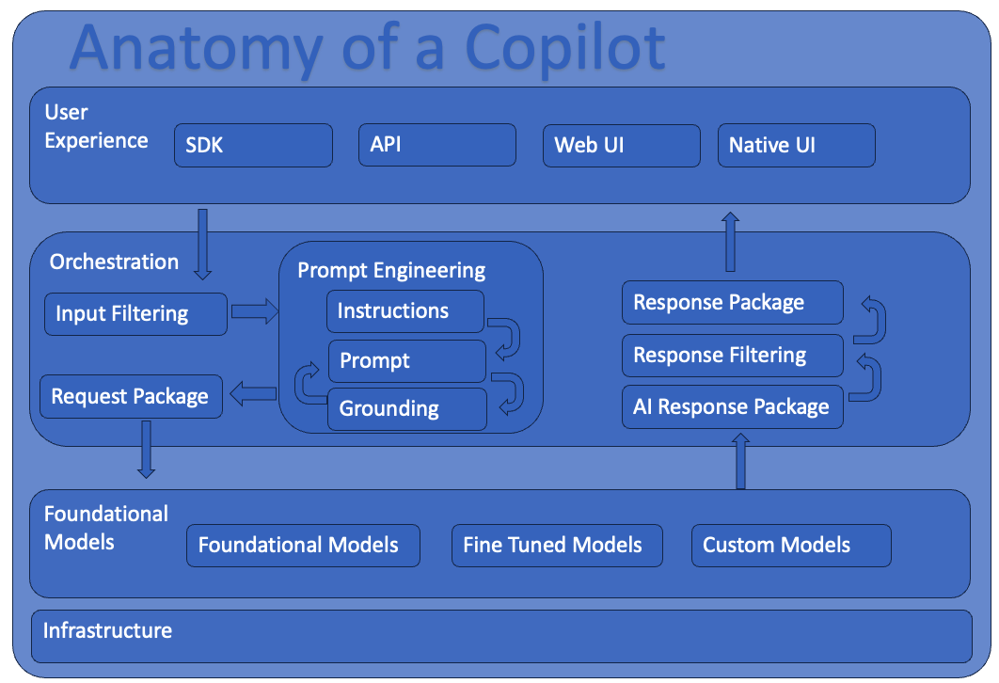

# CoPilot 101

This document walks through the basics of what a copilot is and how they are built. It seperates the concept of a CoPilot and its structure from the actual tools and technologies leveraged to build a copilot. You can find tutorials inside this repo regarding the specifics within the appropriate Tutorial Folder along with the actual code associated to those tutorials.

## What is a CoPilot

CoPilots are advanced and intelligent systems which are designed to work along side users assisting them in completing various tasks. These tasks can range from writing software to designing 3d objects or creating an itinerary for a vacation trip.

## Anatomy of a CoPilot

The first step to building a Copilot is to understand the basic anatomy of a copilot. The below diagram depicts the basic components of a copilot.

While CoPilots themselves have existed for quite some time, the commercialization of Advanced AI Infrastructure and Foundational AI models has democratized the ability to build these copilots while also significantly increasing the quality of existing copilots.

There are 4 key components of a CoPilot: User Experience, Orchestration, Foundational Models & Infrastructure. Each of those key layers can flex from very simple to extremely complex.

### User Experience

A CoPilot assists a user in completing a task. A user may or may not be human and could simply be another system. Therefor a copilot may have many user experiences from SDKs & APIs which are likely to be leveraged by a system potentially an advanced batch processing system or perhaps a WebUI or Native Apps UI such as an iPhone application.

Depending on the sophistication of the orchestration layer, the UX layer may need to take on various responsibilities. Typically, the UX experience is expected to have at minimum an ephemeral knowledge of the current interaction with the copilot. This often takes the form of a list of requests to the copilot & responses from the copilot. The UX may or may not reach out to other systems (or even copilots) to create its requests or better curate responses.

### Ochestration

This is where most of the complexity of a CoPilot tends to live. A well designed co-pilot will have the interactions with the orchestration mechanism(s) well defined. There may even need to be more than one orchestration component within a copilot depending on the User Experience expectations. For example there could be an initial request orchestration interface but also a feedback orchestration interface and the UX leverages both of those orchestration interfaces. They key is to ensure that each orchestration is well defined what the inputs & outputs are and the expectations around what is going to happen when making requests to it.

As most orchestration layers are leveraging Foundational Models, there is a set of basic flows as it pertains to making requests and handling responses from foundational models.

The key steps in the flow are listed below. Note that while these steps are listed in this order, there are many instances where as a result of one of the steps that prior steps may need to be repeated but leveraging new or different information. One of the most common loops that happens is in the area of Prompt Engineering.

- <b>Input Filtering:</b> Used to protect the system from users.
- <b>Instructions:</b> The primary directive and instructions for the Foundational Model. This typically will take the form instructing the AI Model what its job is and some conditions around how it is to complete that job. This can also be reffered to as "System Message".
- <b>Prompt:</b> This is the request & message to the AI system which contains the Instructions, UX requests and additional other information pertinent to the current request.
- <b>Grounding:</b> Additional data that would be pertinent for the Foundational Model to know. This could be details such as documentation relevent to the user request or perhaps historical requests from the user that were not contained within the UX request.
- <b>Request Package:</b> The concrete formulated request to the Foundational Model Layer as that layer requires the request to be formatted.
- <b>AI Response Package:</b> The response from the AI system exactly as it is received.
- <b>Response Filtering:</b> Filtration and safety mechanisms to protect the system & user from the AI system.
- <b>Response Package:</b> Response package designed to be returned back to the UX per the interface definition.

At the end of the day, all the orchestration layer is doing is taking the request from the UX and acting as a broker between that request and the AI System(s) to ensure a high quality response.

Here is some additional reading on prompt engineering as that is one of the key tasks the orchestration layer is performing.

- [Introduction to Prompt Engineering](https://learn.microsoft.com/en-us/azure/ai-services/openai/concepts/prompt-engineering)
- [Prompt Engineering Techniques](https://learn.microsoft.com/en-us/azure/ai-services/openai/concepts/advanced-prompt-engineering?pivots=programming-language-chat-completions)

### Foundational Models

These could be anything from commercially hosted out of the box models such as a vanilla GPT-4 from Azure Open AI service to fully custom build foundational models trained on proprietary data sets.

There are many foundational models from natural language conversational models with significant knowledge to code & image generation models. Even embeddings models are considered foundational models.

Foundational Models are a non deterministic intelligent system. They are not like traditional software and formulating a request and handling the responses from Foundational Models is very important as it pertains to the quality of the CoPilot. Foundational Models may be trained on data that is not up to date or may have certain biases that could be detrimental to the user experience.

### Infrastructure

To run a CoPilot there is substantial infrastructure required. The infrastructure required for the Foundational models to the infrastructure required for the orchestration engine & related components.

Infrastructure can be kept simple and relying on pre-built fully managed Foundational Models such as Azure's Open AI service and PaaS systems for the Orchestration such as Azure Web App Services and SQL Azure for a persistent storage system. It could also be fully self managed on premises data centers and everything in between.
